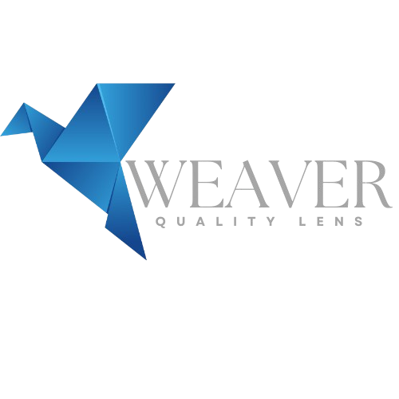

<p align="center">
  
</p>

# Weaver Quality Lens Backend

A comprehensive API for analyzing Azure DevOps test plans, bug metrics, and SonarQube integration. This backend provides analytics and insights for quality engineering teams.

## Features

- **Test Plan Analytics**: Automation coverage, execution metrics, and test case analysis
- **Bug Metrics**: Sprint-based bug analysis, leakage detection, and aging statistics  
- **SonarQube Integration**: Code quality metrics and component analysis
- **Team Analytics**: Cross-team metrics aggregation and comparison
- **Comprehensive API Documentation**: Interactive Swagger/OpenAPI documentation

## Quick Start

### Prerequisites
- Node.js 18+
- Azure DevOps access
- SonarQube access (optional)
- Redis (optional, for caching)

### Installation

```bash
# Install dependencies
npm install

# Set up environment variables (copy .env.example to .env)
cp .env.example .env

# Start development server
npm run dev
```

### API Documentation

Once the server is running, access the interactive API documentation at:
- **Local**: http://localhost:3000/api-docs
- **Root URL**: http://localhost:3000/ (redirects to API docs)

## Environment Variables

Create a `.env` file with the following variables:

```env
# Azure DevOps Configuration
ADO_ORGANIZATION=your-org
ADO_PROJECT=your-project
ADO_PERSONAL_ACCESS_TOKEN=your-pat
AZURE_API_VERSION=7.1-preview.3

# SonarQube Configuration (optional)  
SONAR_DOMAIN=https://sonarqube.your-domain.com
SONAR_ACCESS_TOKEN=your-sonar-token
METRICS_KEY=coverage,branch_coverage,tests,test_errors,test_failures,skipped_tests,test_success_density

# Server Configuration
PORT=3000

# Redis Configuration (optional)
REDIS_URL=redis://localhost:6379

# Custom Field Mappings
ADO_AUTOMATION_STATUS_FIELD=System.Tags
ADO_CUSTOM_AUTOMATION_STATUS_FIELD=Custom.AutomationStatus
ADO_TESTING_TYPE_FIELD=Custom.TestingType
ADO_AUTOMATION_TOOLS_FIELD=Custom.AutomationTools
ADO_BUG_ENVIRONMT_CUSTOM_FIELD=Custom.Environment
ADO_PROD_ENVIRONMENT_LABEL=PROD
```

## API Endpoints

### Organization
- `GET /api/v1/organization/areaPaths` - Get all area paths

### Test Plans  
- `GET /api/v1/testplans` - Get test plans by area paths
- `POST /api/v1/testplans/automation-metrics` - Calculate automation metrics
- `POST /api/v1/testplans/new-automations` - Track newly automated tests
- `POST /api/v1/testplans/suites/coverage` - Get automation coverage per suite

### Test Cases
- `GET /api/v1/testcases` - Get ready test cases
- `POST /api/v1/testcases/usage` - Analyze test case usage

### Team Metrics
- `GET /api/v1/teams/bugs-by-sprint` - Get bug metrics by sprints
- `POST /api/v1/teams/bug-details` - Get detailed bug information  
- `POST /api/v1/teams/bug-leakage` - Analyze bug leakage patterns
- `GET /api/v1/teams/bug-leakage-sprint` - Get bug leakage by sprint
- `GET /api/v1/teams/sprints/automation-metrics` - Get sprint automation metrics

### SonarQube
- `GET /api/v1/components/search` - Search SonarQube components
- `GET /api/v1/measures/component` - Get component quality metrics

## Development

```bash
# Development with hot reload
npm run dev

# Production build
npm run build

# Start production server  
npm start
```

## Documentation

- **API Documentation**: Available at `/api-docs` when server is running
- **Detailed Docs**: See `docs/API_DOCUMENTATION.md`
- **Interactive Testing**: Use the Swagger UI to test endpoints

## Contributing

1. Fork the repository
2. Create a feature branch
3. Make your changes
4. Add/update tests and documentation
5. Submit a pull request

## License

This project is licensed under the MIT License.
